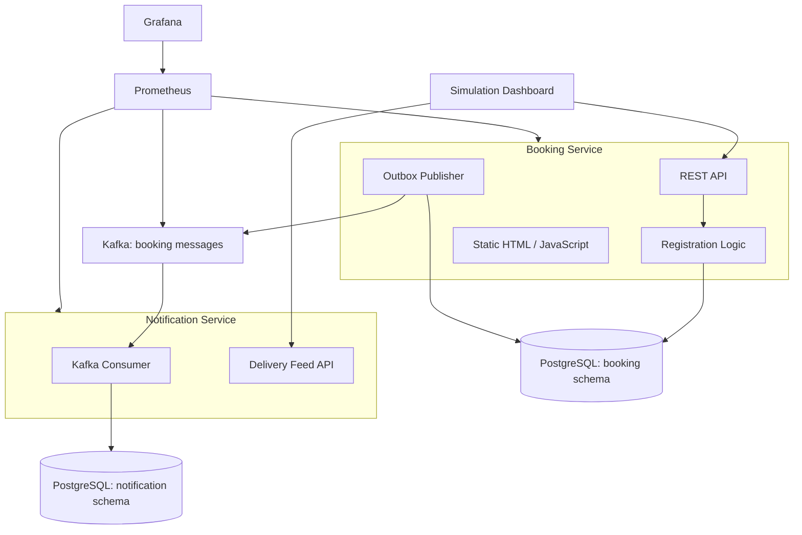
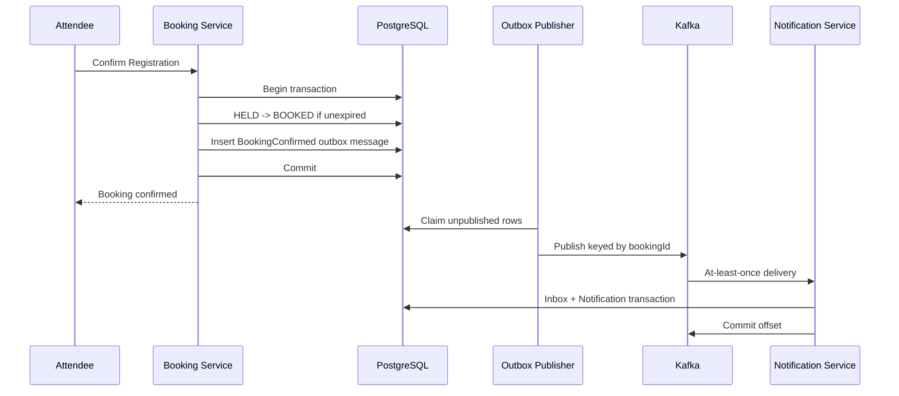

# 系統架構

RushBook 把同步的registration correctness與非同步的post-Booking effects分開。
PostgreSQL 決定誰取得 Spot；Kafka 在該決策 commit 後傳遞結果。

## Container view



## Service boundaries

### Booking Service

擁有 Event、Registration、Booking correctness、transactional outbox、Event
creation、Hold與Confirm APIs，以及static Simulation Dashboard。

建立 Hold 前先lock Event row，再檢查已使用容量。因此熱門Event的request會在
PostgreSQL序列化。這個取捨優先選擇可證明的invariant，而不是最大吞吐量，也
讓load tests有一個值得量測的bottleneck。

Outbox publisher 在 Booking Service 內執行。多個 replicas 透過
`FOR UPDATE SKIP LOCKED`領取工作。

### Notification Service

Consume `BookingConfirmed`，在同一個transaction中保存Inbox record與
Notification result，並提供Dashboard使用的read API。

失敗時先執行三次短暫blocking attempts，再送入DLQ。這能保留partition order，
但接受暫時的head-of-line blocking。

## Data ownership

為了簡化local與CI operations，一個PostgreSQL instance承載兩個logical
schemas。

```text
booking
├── events
├── registrations
└── outbox_messages

notification
├── inbox_messages
└── notification_deliveries
```

每個service擁有自己的Flyway migrations與credentials。禁止cross-schema
query。Dashboard必須透過Notification Service API取得Notification資料。

## Booking transaction與outbox



Kafka不在Booking critical path。如果Kafka暫時無法使用，Booking transaction
仍然commit，outbox會保留待發布工作。

## Kafka contract

Message使用由JSON Schema驗證的versioned JSON。`messageId`識別Kafka message；
payload內的`eventId`才識別RushBook Event。

```json
{
  "messageId": "43ff97e3-b5ff-4b31-b7a0-9254ed012345",
  "messageType": "BookingConfirmed",
  "schemaVersion": 1,
  "occurredAt": "2026-07-25T10:20:30Z",
  "data": {
    "bookingId": "ee5a3107-a57d-421b-a0dc-487729012345",
    "eventId": "bcaf33a8-c30c-4f2e-bbbf-7029d1012345",
    "attendeeId": "12ffbd69-37dc-41db-b978-07d97a012345",
    "confirmedAt": "2026-07-25T10:20:30Z"
  }
}
```

Kafka record以`bookingId`為key。同一個Booking的messages維持順序，而熱門
RushBook Event的所有Bookings不會被迫進入同一個hot partition。

## Kubernetes test environment

kind建立disposable local與CI clusters。它是test target，不是production
runtime。

```text
kind
├── Booking Service Deployment
├── Notification Service Deployment
├── Strimzi Operator
├── KRaft KafkaNodePool
├── single-replica PostgreSQL StatefulSet
├── Prometheus
└── Grafana
```

開發時Strimzi先建立一個同時擔任controller與broker的Kafka node；執行
replication及broker-failure experiments時再切換成三個nodes。PostgreSQL是
local/CI-only的single replica，具有PVC、readiness probe與resource limits；
production deployment應使用managed database或由專業團隊正確營運的database。

RushBook applications使用專案自己維護的Helm chart。Strimzi與observability
stack則透過固定版本的external charts安裝。

## Observability views

- **Simulation Dashboard：**目前的business flow、aggregate counters與最近的
  Notification feed。
- **Grafana：**request latency、transaction duration、outbox backlog與age、
  Kafka lag、retries、DLQ rate、pod readiness、restarts、CPU與memory。
- **README與本文件：**穩定的architecture與trade-offs。

Application絕不取得Kubernetes administration credentials。Failure scripts與
runbooks從application boundary之外操作cluster。

## Decision record

詳細理由與rejected alternatives記錄在[docs/adr](adr/)。
