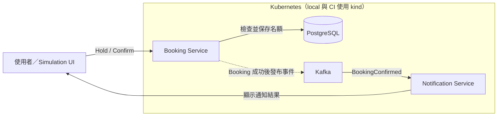

# Lesson 00 — 先看懂 RushBook

> 預計時間：5–10 分鐘
> 這一課不寫程式，只需要先看懂要解決的問題與系統全貌。

## 情境

假設一場活動只有 **10 個名額**，但有 **100 個人同時報名**。

RushBook 必須做到：

1. 最多只能有 10 個人成功，不能超賣。
2. 使用者可以先保留名額，並在時間內確認。
3. 報名成功後，系統會透過 Kafka 通知其他服務。
4. 即使 Kafka 暫時故障，已成功的 Booking 也不能消失。
5. 整套系統最後會部署到 Kubernetes，練習部署、擴充與故障排除。

這就是整個專案的核心。後面的 Lessons 只是一步一步把它實作出來。

## 架構圖

### 每個元件負責什麼？

| 元件 | 工作 | 要學的重點 |
| --- | --- | --- |
| Booking Service | 處理保留與確認名額 | API、transaction、concurrency |
| PostgreSQL | 保存活動與報名狀態 | 如何保證不超賣 |
| Kafka | 傳遞報名成功事件 | producer、consumer、partition、retry |
| Notification Service | 接收事件並產生通知結果 | 非同步處理與避免重複 |
| Kubernetes | 執行與管理整套系統 | Deployment、Service、scaling、recovery |
| Simulation UI | 模擬多人同時搶名額 | 觀察系統在負載與故障下的行為 |

## 一次報名會怎麼流動？

1. 使用者向 Booking Service 要求一個 Hold。
2. Booking Service 使用 PostgreSQL 判斷是否還有名額。
3. 使用者在 Hold 到期前確認 Booking。
4. Booking 成功後，事件透過 Kafka 傳給 Notification Service。
5. UI 顯示誰成功、誰失敗，以及 Kafka consumer 的處理狀況。

最重要的一條界線是：

> **PostgreSQL 決定報名是否成功；Kafka 負責成功之後的非同步工作。**

因此 Kafka 暫時故障時，Booking 仍然可以成功。系統會保存待發布的事件，等
Kafka 恢復後再送出。這個做法叫做 **transactional outbox**，之後會有獨立
Lesson 實作，現在先知道目的即可。

## 這個專案會學到什麼？

- 用 database transaction 解決多人同時搶名額。
- 用 Kafka 將同步 Booking 與非同步 Notification 分開。
- 處理 Kafka 重複傳遞、consumer failure、retry 與 DLQ。
- 用 Docker、Helm 與 kind 將 services 部署到 Kubernetes。
- 從 UI、logs、metrics 與 Grafana 觀察整條流程。

## 現在不用先懂的內容

以下名詞在後面的 Lesson 遇到時再學即可：

- row lock 與 `SELECT ... FOR UPDATE`
- transactional outbox
- Kafka partition key
- idempotent consumer 與 Inbox
- retry、DLQ、consumer lag
- Strimzi、KRaft 與 Helm

如果想先看完整設計，可以閱讀：

- [產品行為與規則](../product-scope.md)
- [完整系統架構](../architecture.md)
- [為什麼這樣設計](../adr/)
- [後續課程順序](README.md)

## 完成本課

你現在只需要能用自己的話說明：

> RushBook 是一套不超賣的活動報名系統。PostgreSQL 負責決定報名結果，
> Kafka 負責把成功事件交給其他服務，最後整套系統會跑在 Kubernetes 上。

能說出這段話，就可以直接進入 Lesson 01。

選讀：10 題快速自我檢查與答案

### 問題

1. RushBook 要解決的生活情境是什麼？
2. 為什麼不能只靠 UI 停用按鈕來防止超賣？
3. 哪個元件最終決定 Booking 是否成功？
4. Kafka 在這個系統中負責什麼？
5. Kafka 暫時故障時，Booking 是否應該失敗？
6. Notification Service 做什麼？
7. 為什麼需要處理重複的 Kafka message？
8. Kubernetes 在這個專案中扮演什麼角色？
9. Simulation UI 有什麼學習價值？
10. Lesson 00 是否需要先理解所有 Kafka 與 Kubernetes 細節？

### 答案

1. 許多人同時競爭少量活動名額，而且系統不能超賣。
2. 多個 requests 可能同時到達不同的 server；UI 狀態無法保護 database。
3. PostgreSQL 中的 Booking transaction。
4. 在 Booking 成功後，將事件可靠地傳給 Notification 等下游服務。
5. 不應該。Booking 結果先安全地存進 PostgreSQL，事件之後再補送。
6. 消費 Kafka event，並建立可在 UI 上查看的通知結果。
7. Kafka 採 at-least-once delivery，同一則 message 在 failure 後可能再次送達。
8. 負責執行、部署、擴充及重新啟動 RushBook 的 services。
9. 它可以產生多人同時報名與故障情境，讓抽象概念變成看得見的結果。
10. 不需要；現在先理解元件分工，細節會在後續 Lessons 逐步實作。

