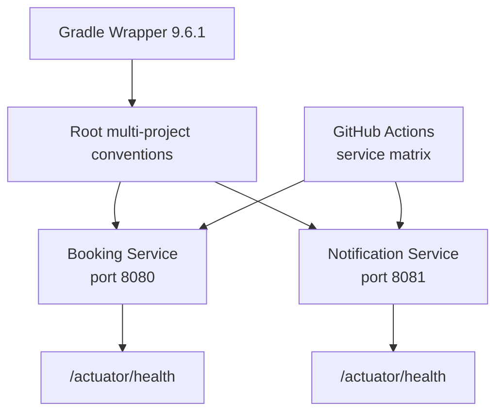

# Lesson 01 — 建立 two-service skeleton

## 目標

完成這一課後，你可以：

- 使用 Gradle Wrapper 一次建置整個 RushBook；
- 分別啟動 Booking Service 與 Notification Service；
- 從公開的 HTTP health endpoint 判斷 application 是否已啟動；
- 說明 monorepo、service process 與 Gradle subproject 之間的差異。

這一課刻意不加入 Event、PostgreSQL 或 Kafka。目標是先建立一個小而可信的
執行基線，後面的每一項 architecture change 才有穩定的落點。

## 核心觀念

### Monorepo 不等於 monolith

RushBook 將兩個 services 放在同一個 Git repository，讓版本、build conventions
與教學 checkpoint 保持一致。但它們各自有：

- application entry point；
- dependency boundary；
- process 與 port；
- build、test 和未來的 deployment unit。

因此「一起管理 source code」不代表「只能一起執行或部署」。

### Gradle multi-project build

root project 負責共用的 Java toolchain、repositories 與測試規則；兩個
subprojects 則各自宣告 Spring Boot plugins 與 dependencies。這讓共用規則只有
一份，又不會把兩個 services 合成同一個 application。

Gradle Wrapper 將 Gradle 版本固定為 9.6.1，並驗證 distribution SHA-256。
開發者與 CI 都執行 `./gradlew`，不依賴電腦上是否另外安裝 Gradle。

### Health endpoint 是最小公開 seam

Spring Boot Actuator 提供 `/actuator/health`。本課的 tests 會真的啟動 embedded
HTTP server，從隨機 port 呼叫這個 endpoint，而不是只檢查某個 class 是否存在。

`UP` 只能證明 application context、web server 與 health endpoint 正常；它還
不能證明尚未加入的 PostgreSQL、Kafka 或 domain behavior 正常。

## 問題情境

Lesson 00 只有設計與決策，repository 還不能回答以下問題：

- Java 與 Spring Boot 的版本是否真的相容？
- Booking 與 Notification 是否能各自成為一個 process？
- 新環境是否能用相同指令建置？
- CI 如何指出是哪一個 service 失敗？

如果直接開始寫 Booking domain code，任何失敗都可能來自 build、framework、
service boundary 或 domain logic，學習者很難判斷真正原因。

## 改動前


## 改動後



## 先自己試試看

在看實作前，先思考：

> 如果兩個 services 在同一個 repository，哪些設定應該共用，哪些設定必須各自
> 擁有，才能讓它們未來獨立部署？

寫下你的答案，至少涵蓋 Java version、dependencies、application entry point、
port 與 tests，再與下一節比較。

## 實作導覽

- [settings.gradle.kts](../../settings.gradle.kts) 宣告 root project 與兩個
  subprojects。
- [build.gradle.kts](../../build.gradle.kts) 固定 Spring Boot 版本、Java 25
  toolchain、Maven Central 與 JUnit Platform。
- [Booking Service build](../../booking-service/build.gradle.kts) 與
  [Notification Service build](../../notification-service/build.gradle.kts)
  各自套用 Spring Boot，並加入 Spring MVC、Actuator 和測試 dependencies。
- [BookingServiceApplication.java](../../booking-service/src/main/java/dev/rushbook/booking/BookingServiceApplication.java)
  與
  [NotificationServiceApplication.java](../../notification-service/src/main/java/dev/rushbook/notification/NotificationServiceApplication.java)
  是兩個獨立的 process entry points。
- 兩個 `application.properties` 使用不同 application name 與預設 port，因此能
  同時在本機執行。
- 兩個 application tests 都從 HTTP 呼叫 health endpoint，不 mock Spring 內部
  元件。
- [Build workflow](../../.github/workflows/build.yml) 以 matrix 分開執行兩個
  service builds，GitHub UI 會直接顯示是哪個 service 失敗。

## 為什麼選這個設計

### 為什麼現在就拆成兩個 services？

後續要展示 Kafka consumer 能獨立停止、恢復與 scaling。如果現在建立單一
application，Lesson 08 才拆 service，屆時 domain、configuration、tests 與
deployment 會一起大幅變動，反而模糊 Kafka 的學習重點。

### 為什麼仍使用一個 repository？

RushBook 是小型系統與線性課程。兩個 repositories 會增加 version coordination、
cross-repository changes 與教學 checkpoint 管理成本，卻沒有帶來相稱價值。

### 為什麼使用 Spring MVC？

目前公開介面是一般 request/response HTTP APIs，後續 correctness 主要依賴
PostgreSQL transactions。傳統 synchronous request model 比 reactive stack 更
直接，也更容易把 transaction boundary 講清楚。

### 為什麼測試使用隨機 port？

隨機 port 避免測試與本機正在執行的 application 或其他測試互相衝突。測試仍然
透過真實 HTTP boundary 驗證行為，不需要依賴固定的 8080 或 8081。

## 如何測試

先確認 Java 與 Wrapper：

```bash
java -version
./gradlew --version
```

執行完整 build：

```bash
./gradlew --no-daemon clean build
```

只測試單一 service：

```bash
./gradlew --no-daemon :booking-service:test
./gradlew --no-daemon :notification-service:test
```

啟動 Booking Service：

```bash
./gradlew :booking-service:bootRun
```

在另一個 terminal 觀察 health：

```bash
curl --fail --silent http://localhost:8080/actuator/health
```

停止 Booking Service後，啟動 Notification Service：

```bash
./gradlew :notification-service:bootRun
```

再從另一個 terminal 觀察：

```bash
curl --fail --silent http://localhost:8081/actuator/health
```

## 預期證據

- `java -version` 顯示 Java 25。
- `./gradlew --version` 顯示 Gradle 9.6.1 與 JVM 25。
- 完整 build 最後顯示 `BUILD SUCCESSFUL`。
- 測試報告各包含一個通過的 health endpoint test。
- 兩個 health requests 都回傳：

```json
{"groups":["liveness","readiness"],"status":"UP"}
```

JSON 欄位順序不是 contract；重要證據是 HTTP 200 與 `status` 為 `UP`。

- GitHub Actions 會分別顯示 `booking-service build` 與
  `notification-service build`。

## 故障實驗

先啟動 Booking Service，再刻意要求 Notification Service 使用相同 port：

```bash
./gradlew :booking-service:bootRun
```

另一個 terminal：

```bash
./gradlew :notification-service:bootRun --args='--server.port=8080'
```

預測：Notification Service 無法啟動，log 會指出 8080 已被使用；已啟動的
Booking Service 仍維持 `UP`。這證明它們是兩個 process，但也說明同一台 host
上的 processes 需要不同 listen ports。

恢復方式：停止失敗的 command，使用 Notification Service 預設的 8081 重新
啟動。實驗結束後，用 `Ctrl-C` 正常停止兩個 applications。

## 理解題

1. 兩個 services 放在同一個 repository，為什麼仍不是單一 monolith process？
2. root build 與 service build 各自負責什麼？
3. 為什麼應該執行 `./gradlew`，而不是要求每位學習者自行安裝 Gradle？
4. `/actuator/health` 回傳 `UP`，能證明什麼？不能證明什麼？
5. 為什麼 automated tests 使用隨機 port？
6. 為什麼 tests 要真的呼叫 HTTP，而不只使用空的 `contextLoads`？
7. 為什麼兩個 services 的本機預設 port 不同？
8. Notification Service 無法啟動時，為什麼 Booking Service 仍可能保持 `UP`？
9. 為什麼 Lesson 01 不直接加入 PostgreSQL 與 Kafka？
10. 進入 Lesson 02 前，哪些證據能證明 skeleton 已準備好？

<details>
<summary>答案與預期推理</summary>

### 1

Repository 是 source code 與版本管理邊界；process 是 runtime boundary。兩個
services 有不同 entry points、ports、build outputs，能分別啟動與停止，因此
不是同一個 process。

### 2

root build 管理共用版本、repositories、Java toolchain 與測試平台；service
build 只宣告該 application 所需 plugins 和 dependencies。這避免複製共用規則，
又維持 dependency ownership。

### 3

Wrapper 把 Gradle 版本與 distribution checksum 放入 repository。開發者與 CI
會取得相同工具版本，也能驗證下載內容；全域安裝的 Gradle 可能缺少、過舊或
與 Java 25 不相容。

### 4

`UP` 證明 Spring application context、embedded HTTP server 與目前註冊的 health
checks 正常。這一課尚未加入 database 或 Kafka，因此不能從 `UP` 推論它們正常，
也不能推論任何 Booking domain invariant 已成立。

### 5

隨機 port 避免 parallel tests、本機 processes 或 CI jobs 爭用固定 port。測試
從注入的實際 port 呼叫 HTTP，因此仍驗證公開 boundary。

### 6

`contextLoads` 只證明 Spring wiring 能建立。真實 HTTP request 還會經過 socket、
embedded server、routing、Actuator serialization，提供更接近使用者可觀察行為
的證據。

### 7

同一 host 的兩個 processes 不能同時 listen 相同 address 與 port。使用 8080
和 8081，學習者才能同時執行兩個 services。

### 8

兩個 services 是不同 processes，目前沒有同步 dependency。Notification 的
startup failure 不會終止 Booking process；這是後續展示 failure isolation 的
最小基礎。

### 9

一次加入 build、兩個 services、database 與 Kafka，失敗時很難隔離原因。先讓
最小 HTTP skeleton 綠燈，下一課才能把 PostgreSQL 當成單一 architecture delta。

### 10

合格證據包括：Wrapper 顯示固定 Gradle 與 Java 版本、完整 build 成功、兩個
HTTP health tests 通過、兩個 services 能分別啟動，以及 CI matrix 能獨立顯示
各 service 結果。

</details>
