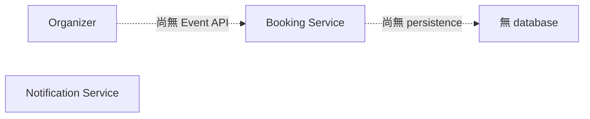
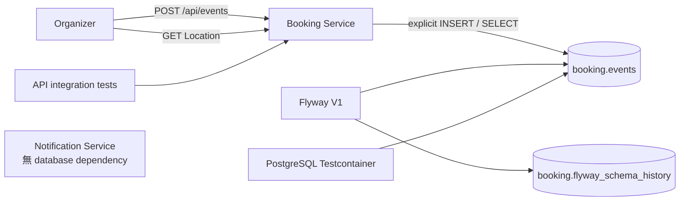

# Lesson 02 — 建立 Events 與 database migrations

## 目標

完成這一課後，你可以：

- 透過公開 HTTP API 建立並讀回 Event；
- 使用 Flyway 在全新的 PostgreSQL 建立可追蹤版本的 schema；
- 使用 Spring JDBC 撰寫清楚可見的 SQL；
- 使用真實 PostgreSQL Testcontainers 驗證 API、migration 與 validation；
- 說明 application validation、database constraints 與 service data ownership
  各自解決什麼問題。

這一課只讓 Booking Service 使用 PostgreSQL。Notification Service 尚未擁有
database objects，也不會讀取 `booking` schema。

## 核心觀念

### Migration 是 database 的版本歷史

application code 可以由 Git 還原，但既有 database 不能在每次部署時刪除重建。
Flyway 依序執行 `V1__...sql` 這類 migration，並在
`booking.flyway_schema_history` 記錄已執行的版本與 checksum。

已發布的 migration 應視為 immutable。若 schema 需要改變，加入 V2，而不是
修改已在其他環境執行過的 V1。

### Schema ownership 是 service boundary

RushBook 未來會讓兩個 services 共用一個 PostgreSQL instance，但各自擁有：

- schema；
- credentials；
- Flyway history；
- SQL 與資料生命週期。

Booking Service 的設定只接受 `RUSHBOOK_BOOKING_DB_*` environment variables，
SQL 也明確使用 `booking.events`。這不等於 database-level security 已全部完成，
但已建立不跨 schema query 的 application boundary。

### Explicit SQL 讓 correctness 可以 review

本課使用 Spring JDBC，而不是 JPA。Event insert、constraints、schema 名稱與
database-generated `created_at` 都直接出現在 SQL 中。後續加入 row locks、
conditional transitions 與 `SKIP LOCKED` 時，不需要猜測 ORM 何時 flush。

### Validation 有兩層

- HTTP boundary 使用 Bean Validation，讓無效 request 得到 `400`。
- PostgreSQL constraints 保護所有寫入路徑，即使未來某段 code 忘了做 request
  validation，也不能留下 capacity `0` 或非法 Hold Period。

兩層不是重複浪費：它們面對不同 failure boundary。

### 為什麼測試不用 H2？

H2、mock repository 或 in-memory collection 不能證明 PostgreSQL schema、
Flyway、JDBC mapping 與 constraints 真的正確。Testcontainers 會為測試啟動
全新的 PostgreSQL 18.3；Spring Boot 的 `@ServiceConnection` 將 container
connection details 同時交給 JDBC 與 Flyway。

## 問題情境

Lesson 01 的兩個 services 可以啟動，但沒有任何 domain state。即使 Event API
只把 request 原樣回傳，看起來也可能「成功」，卻無法回答：

- process restart 後 Event 是否還存在？
- capacity 與 Hold Period 是否真的受到保護？
- 新環境是否能建立相同 schema？
- table 與 migration history 屬於哪一個 service？

## 改動前



## 改動後



## 先自己試試看

先設計一張 Event table與建立 Event API，回答：

1. 哪些 invariants 應同時存在於 request validation 與 database constraints？
2. 如果 POST response 只回傳 request，測試如何從公開介面證明資料已持久化？
3. Flyway history 應放在 `public` 還是 service 自己的 schema？為什麼？

再比較本課採用的 `POST → Location → GET` 測試流程。

## 實作導覽

- [V1 migration](../../booking-service/src/main/resources/db/migration/V1__create_events.sql)
  建立 `booking.events`，包含 primary key、capacity、Hold Period 與非空 name
  constraints。
- [application.properties](../../booking-service/src/main/resources/application.properties)
  使用 `RUSHBOOK_BOOKING_DB_URL`、`RUSHBOOK_BOOKING_DB_USERNAME`、
  `RUSHBOOK_BOOKING_DB_PASSWORD`，並將 Flyway default schema 與 history
  指向 `booking`。
- [EventController.java](../../booking-service/src/main/java/dev/rushbook/booking/event/EventController.java)
  提供：
  - `POST /api/events`
  - `GET /api/events/{eventId}`
- [CreateEventRequest.java](../../booking-service/src/main/java/dev/rushbook/booking/event/CreateEventRequest.java)
  在 HTTP boundary 驗證 name、capacity 與 Hold Period。
- [EventService.java](../../booking-service/src/main/java/dev/rushbook/booking/event/EventService.java)
  套用 120 秒 default，並產生 `eventId`。
- [EventRepository.java](../../booking-service/src/main/java/dev/rushbook/booking/event/EventRepository.java)
  使用 schema-qualified SQL，insert 後從 PostgreSQL `RETURNING` 取得完整 Event。
- [BookingServiceTestConfiguration.java](../../booking-service/src/test/java/dev/rushbook/booking/BookingServiceTestConfiguration.java)
  建立由 Spring 管理、可供 Booking integration tests 共用的 PostgreSQL
  Testcontainer，並透過 `@ServiceConnection` 注入 connection details。
- [EventApiIntegrationTest.java](../../booking-service/src/test/java/dev/rushbook/booking/event/EventApiIntegrationTest.java)
  從公開 HTTP API 驗證 default、custom value、讀回 persistence 與 validation。

建立 Event request：

```json
{
  "name": "Kafka Summit",
  "capacity": 10
}
```

成功 response：

```json
{
  "eventId": "<uuid>",
  "name": "Kafka Summit",
  "capacity": 10,
  "holdPeriodSeconds": 120,
  "createdAt": "<database timestamp>"
}
```

POST 回傳 `201 Created`，`Location` 指向可讀回該 Event 的 GET endpoint。

## 為什麼選這個設計

### 為什麼 `eventId` 在 application 產生？

UUID 不需要先向 database 取得 sequence value，未來多 replicas 也能各自產生
不衝突的 identifiers。PostgreSQL primary key 仍是最終 uniqueness enforcement。

### 為什麼 `createdAt` 由 database 產生？

它代表 row 被 database 接受的時間。由 PostgreSQL `clock_timestamp()` 產生，
不依賴 application hosts 的 clock 是否完全一致。

### 為什麼增加 GET？

GET 是證明 persistence 的最小公開 seam。測試先 POST，再依 Location GET；
不需要從測試直接 query table，也不會把測試綁死在 repository implementation。

### 為什麼 local password 可以出現在設定？

`replace-me-for-local-only` 是明顯無效、沒有外部權限的示範 placeholder，僅用於
一次性的 local container。真實環境必須用 environment variables 或 secret
store 覆寫，不能將 credentials 寫進 Git。

## 如何測試

先確認 Docker engine：

```bash
docker info
```

強制執行 Event API integration tests，不使用先前的 Gradle test cache：

```bash
./gradlew --no-daemon :booking-service:test \
  --tests dev.rushbook.booking.event.EventApiIntegrationTest \
  --rerun-tasks
```

執行全部 tests：

```bash
./gradlew --no-daemon clean build
```

### Live API experiment

啟動 local-only PostgreSQL：

```bash
docker run --rm --detach \
  --name rushbook-lesson-02-postgres \
  --publish 5432:5432 \
  --env POSTGRES_DB=rushbook \
  --env POSTGRES_USER=booking_app \
  --env POSTGRES_PASSWORD=replace-me-for-local-only \
  postgres:18.3-alpine
```

等待 PostgreSQL ready：

```bash
docker exec rushbook-lesson-02-postgres \
  pg_isready --username booking_app --dbname rushbook
```

啟動 Booking Service：

```bash
./gradlew :booking-service:bootRun
```

另一個 terminal 建立 Event：

```bash
curl --silent --include \
  --request POST http://localhost:8080/api/events \
  --header 'Content-Type: application/json' \
  --data '{"name":"Kafka Summit","capacity":10}'
```

複製 response 的 Location，再讀回 Event：

```bash
curl --fail --silent http://localhost:8080/api/events/<event-id>
```

驗證 validation：

```bash
curl --silent --output /dev/null --write-out '%{http_code}\n' \
  --request POST http://localhost:8080/api/events \
  --header 'Content-Type: application/json' \
  --data '{"name":"Invalid Event","capacity":0}'
```

觀察 schema ownership、tables 與 migration history：

```bash
docker exec rushbook-lesson-02-postgres \
  psql --username booking_app --dbname rushbook --command '\dn booking'

docker exec rushbook-lesson-02-postgres \
  psql --username booking_app --dbname rushbook --command '\dt booking.*'

docker exec rushbook-lesson-02-postgres \
  psql --username booking_app --dbname rushbook \
  --command 'SELECT installed_rank, version, description, success
             FROM booking.flyway_schema_history;'
```

實驗結束後，在 Booking terminal 按 `Ctrl-C`，再移除 local database：

```bash
docker stop rushbook-lesson-02-postgres
```

## 預期證據

- integration test report 顯示 5 tests、0 failures、0 errors。
- Flyway log 顯示：

```text
Migrating schema "booking" to version "1 - create events"
Successfully applied 1 migration to schema "booking"
```

- POST 回傳 `201`、Location 與具有 UUID 的 Event。
- GET 回傳與 POST 相同的 name、capacity、Hold Period 與 `eventId`。
- 未提供 Hold Period 時，response 是 `120`。
- capacity `0` 回傳 `400`。
- `\dn booking` 顯示 owner 是 `booking_app`。
- `\dt booking.*` 只顯示 `events` 與 `flyway_schema_history`。
- Flyway history 顯示 V1 `create events` 且 `success = true`。

## 故障實驗

不啟動 PostgreSQL，刻意讓 Booking Service 指向沒有 listener 的 port：

```bash
./gradlew :booking-service:bootRun \
  --args='--spring.datasource.url=jdbc:postgresql://localhost:65432/rushbook'
```

先預測：Flyway 無法取得 connection，所以 application context 不會完成，
Booking Service 也不會錯誤地對外宣告 ready。

實際關鍵證據：

```text
Unable to obtain connection from database
Connection to localhost:65432 refused
BUILD FAILED
```

恢復方式：用前一節的 `docker run` 啟動 PostgreSQL，再以正常的
`./gradlew :booking-service:bootRun` 重啟 application。Flyway 會在開始接受
request 前完成 migrations。

## 理解題

1. 為什麼 integration tests 使用 PostgreSQL，而不是 H2？
2. Flyway history table 解決什麼問題？
3. 為什麼已發布的 V1 migration 不應直接修改？
4. 為什麼 SQL 明確寫 `booking.events`？
5. HTTP validation 與 database constraints 為什麼都需要？
6. POST 後再 GET 如何比直接查 table 更適合作為 API test？
7. 為什麼 Hold Period 未提供時是 120，但 `null` 仍能通過數值 annotations？
8. PostgreSQL 無法連線時，為什麼 Booking Service 應該 startup failure？
9. Testcontainers 的 `@ServiceConnection` 在本課扮演什麼角色？
10. Lesson 03 加入 Hold concurrency 前，本課提供了哪些可信基礎？

<details>
<summary>答案與預期推理</summary>

### 1

RushBook 的 correctness 依賴 PostgreSQL dialect、constraints、transactions 與
後續 row locks。H2 或 mock 的語意不同，即使測試通過也不能證明 production SQL
能執行。Testcontainers 讓每次測試使用真正且全新的 PostgreSQL。

### 2

它記錄哪些 migrations 已執行、執行順序、checksum 與結果。application restart
時 Flyway 不會重複執行 V1，也能在 migration 被意外修改時偵測不一致。

### 3

某些 environments 可能已執行舊 V1。修改檔案不會可靠地修改那些 databases，
反而造成 checksum mismatch 與環境分歧。正確方式是加入新的 V2 migration。

### 4

schema-qualified SQL 讓 data ownership 在 code review 時直接可見，也避免
connection search path 改變後誤讀 `public.events` 或其他 service 的同名 table。

### 5

HTTP validation 提供快速、清楚的 `400` client contract；database constraints
保護所有寫入來源與 race boundary。移除前者會把 client mistake 變成 `500`；
移除後者則可能讓其他 code path 寫入非法 state。

### 6

POST → Location → GET 只依賴公開 contract，即使未來 repository 或 table layout
重構，行為不變時測試仍可通過。直接查 table 會把 API test 綁在 internal schema
shape。

### 7

Bean Validation 的 `@Min`／`@Max` 預設不拒絕 `null`，因此 optional 欄位可以
省略；EventService 再將 `null` 轉成 120。若要禁止 `null`，還需要 `@NotNull`。

### 8

Event API 的正確行為依賴 migrations 與 database constraints。database 尚未
ready 時讓 application startup 失敗，可避免 pod 或 process 接受必然失敗的
requests，也讓後續 readiness semantics 誠實。

### 9

它從 PostgreSQL container 建立 JDBC 與 Flyway connection details，並覆寫一般
application connection properties。測試不需手動拼接隨機 host port、username
與 password。

### 10

本課建立了 versioned Event schema、explicit SQL、database constraints、公開
Event APIs、真實 PostgreSQL integration tests、service-owned credentials 與
可重建 migrations。Lesson 03 可以專注在 Hold transaction 與 row locking，
不必同時解決 persistence 基線。

</details>
