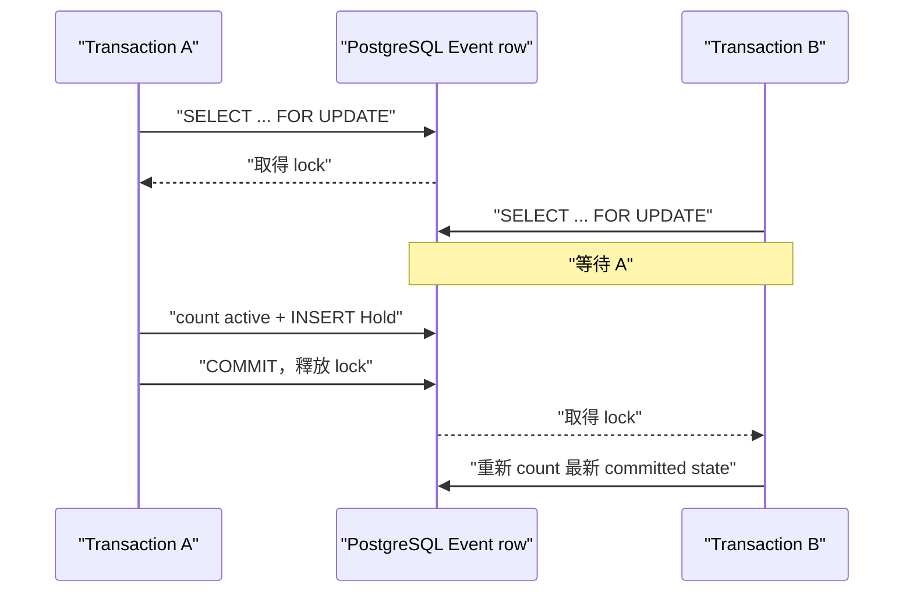
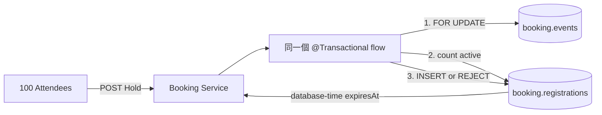

# Lesson 03 — 防止超賣

## 目標

完成這一課後，你可以：

- 讓 Attendee 透過公開 API 取得 Held Registration；
- 說明為什麼「先 count、再 insert」在 concurrency 下仍會超賣；
- 使用 PostgreSQL `SELECT ... FOR UPDATE` 將同一 Event 的 Hold creation
  serialize；
- 用 database time 產生每一筆 Hold 的 `expiresAt`；
- 用 100 個 concurrent requests 證明十個 Spots 恰好只有十個 Holds；
- 說明 RushBook 保證 correctness，但不宣稱 strict FIFO。

## 問題情境

Event capacity 是 10。若 100 個 requests 同時執行：

1. 每個 transaction 都讀到目前只有 0 個 Holds；
2. 每個 transaction 都判斷還有空位；
3. 每個 transaction 都 insert；

最後可能出現超過 10 筆 Holds。`@Transactional` 只能保證每個 transaction
自己的操作一起成功或失敗，不會自動讓不同 transactions 排隊。

## 核心觀念

### Lock 一筆已存在、所有競爭者都知道的 row

新 Registration 尚未存在，無法先鎖它。每個 Hold request 都知道 `eventId`，
因此 RushBook 使用 Event row 作為 serialization point：

```sql
SELECT capacity, hold_period_seconds
FROM booking.events
WHERE event_id = :eventId
FOR UPDATE;
```

同一 Event 的其他 transactions 會等待這個 row lock。不同 Events 鎖不同 rows，
仍可並行處理。

### Lock、count 與 insert 必須在同一 transaction



如果 `FOR UPDATE` 與 insert 分屬不同 transactions，第一個 method 結束時 lock
就會釋放，保護效果消失。本課將完整流程放在同一個 `@Transactional`
service method。

### PostgreSQL 是 capacity 與時間的 source of truth

Occupied Spot 定義為：

- `BOOKED` Registration；或
- `HELD` 且 `expires_at > clock_timestamp()` 的 Registration。

所有 replicas 都用 PostgreSQL time 判斷，而不是各自 application host 的
clock。建立 Hold 時，`expiresAt` 也由 SQL 計算：

```sql
clock_timestamp() + make_interval(secs => :holdPeriodSeconds)
```

### Row lock 與 unique index 保護不同 invariants

- Event row lock：保護「總 active Registrations 不超過 capacity」。
- partial unique index：保護「同一 Attendee 與 Event 最多一筆 Held 或 Booked」。

即使目前 API 已在 lock 內先查 duplicate，database constraint 仍保護未來新增的
write paths。

### Correctness 不等於 strict FIFO

RushBook 將 Spot 給最先成功 commit 的 transactions，不保證最早點擊或最早到達
load balancer 的 request 一定成功。Strict FIFO 需要具有全域順序的 admission
queue，會是另一個更大的設計。

## 架構變化

### 改動前


### 改動後



## API contract

建立 Hold：

```http
POST /api/events/{eventId}/holds
Content-Type: application/json

{"attendeeId":"attendee-001"}
```

成功時回傳 `201 Created`：

```json
{
  "outcome": "HELD",
  "registration": {
    "registrationId": "<uuid>",
    "eventId": "<uuid>",
    "attendeeId": "attendee-001",
    "status": "HELD",
    "expiresAt": "<database timestamp>"
  }
}
```

capacity 用盡時回傳穩定的 `409 Conflict`：

```json
{
  "outcome": "REJECTED",
  "reason": "CAPACITY_EXHAUSTED",
  "eventId": "<uuid>",
  "attendeeId": "attendee-011"
}
```

同一 Attendee 已有 Held 或 Booked Registration 時，也回傳 `409`，reason 是
`ACTIVE_REGISTRATION_EXISTS`。不存在的 Event 回傳 `404` 與
`EVENT_NOT_FOUND`。

## 先自己試試看

在閱讀實作前先回答：

1. 只加 `@Transactional`、不加 row lock，為什麼仍可能超賣？
2. 為什麼鎖 Event row，而不是鎖 Registrations query 的結果？
3. `count active` 應在取得 lock 前還是後執行？

## 實作導覽

- [V2 migration](../../booking-service/src/main/resources/db/migration/V2__create_registrations.sql)
  建立 `booking.registrations`、foreign key、status constraint、partial unique
  index 與 capacity lookup index。
- [HoldController.java](../../booking-service/src/main/java/dev/rushbook/booking/registration/HoldController.java)
  將 Held、capacity rejection、duplicate 與 missing Event 映射成穩定 HTTP
  results。
- [HoldService.java](../../booking-service/src/main/java/dev/rushbook/booking/registration/HoldService.java)
  使用一個 `@Transactional` boundary 包住 lock、duplicate check、capacity
  check 與 insert。
- [RegistrationRepository.java](../../booking-service/src/main/java/dev/rushbook/booking/registration/RegistrationRepository.java)
  明確呈現 `FOR UPDATE`、database-time capacity query 與 insert SQL。
- [HoldApiIntegrationTest.java](../../booking-service/src/test/java/dev/rushbook/booking/registration/HoldApiIntegrationTest.java)
  從公開 HTTP boundary 驗證成功、穩定 rejection、duplicate、validation、
  missing Event 與 100-way race。

## 如何測試

先確認 Docker engine：

```bash
docker info
```

強制執行 Hold API integration tests：

```bash
./gradlew --no-daemon :booking-service:test \
  --tests dev.rushbook.booking.registration.HoldApiIntegrationTest \
  --rerun-tasks
```

Concurrency case 使用 100 個 virtual threads 同時送出 requests，並固定重複三次。
每次都必須得到：

```text
201 HELD: 10
409 CAPACITY_EXHAUSTED: 90
```

執行全部 modules：

```bash
./gradlew --no-daemon clean build
```

## Live API experiment

啟動 local-only PostgreSQL：

```bash
docker run --rm --detach \
  --name rushbook-lesson-03-postgres \
  --publish 5432:5432 \
  --env POSTGRES_DB=rushbook \
  --env POSTGRES_USER=booking_app \
  --env POSTGRES_PASSWORD=replace-me-for-local-only \
  postgres:18.3-alpine
```

等待 ready，然後啟動 Booking Service：

```bash
docker exec rushbook-lesson-03-postgres \
  pg_isready --username booking_app --dbname rushbook

./gradlew :booking-service:bootRun
```

另一個 terminal 建立 capacity 1 的 Event：

```bash
curl --silent --include \
  --request POST http://localhost:8080/api/events \
  --header 'Content-Type: application/json' \
  --data '{"name":"One Spot Lab","capacity":1}'
```

從 Location 複製 `<event-id>`，第一位 Attendee 建立 Hold：

```bash
curl --silent --include \
  --request POST http://localhost:8080/api/events/<event-id>/holds \
  --header 'Content-Type: application/json' \
  --data '{"attendeeId":"attendee-001"}'
```

第二位 Attendee 會得到 `409 CAPACITY_EXHAUSTED`：

```bash
curl --silent --include \
  --request POST http://localhost:8080/api/events/<event-id>/holds \
  --header 'Content-Type: application/json' \
  --data '{"attendeeId":"attendee-002"}'
```

觀察 database-time state：

```bash
docker exec rushbook-lesson-03-postgres \
  psql --username booking_app --dbname rushbook \
  --command "SELECT attendee_id,
                    status,
                    expires_at,
                    expires_at > clock_timestamp() AS active
             FROM booking.registrations
             ORDER BY created_at;"
```

完成後在 Booking terminal 按 `Ctrl-C`，再移除 database：

```bash
docker stop rushbook-lesson-03-postgres
```

## 實際證據

完整 Hold test report：

```text
tests: 8
failures: 0
errors: 0
```

八個 test executions 包含 concurrency case 的三次 repetitions。每次都是
100 位 Attendees 競爭 10 個 Spots，結果皆為恰好 10 個 Holds。

## 故障實驗：拿掉 row lock

在 exercise branch 暫時刪除 `RegistrationRepository.lockEvent` SQL 中的
`FOR UPDATE`，其他 code 與 test 都不改，再執行 concurrency test：

```bash
./gradlew --no-daemon :booking-service:test \
  --tests \
  dev.rushbook.booking.registration.HoldApiIntegrationTest.oneHundredAttendeesCompetingForTenSpotsCreateExactlyTenHolds \
  --rerun-tasks
```

實際三次 repetitions 中有兩次失敗：

```text
Expected size: 10 but was: 12
Expected size: 10 but was: 11
```

這證明 transaction 裡的 `count → insert` 本身不足以防止 race。還原
`FOR UPDATE` 後，三次 repetitions 全部恢復為 10。

## 本課刻意還沒做什麼

本課尚未提供 Confirm API，也尚未把過期的 `HELD` 狀態 lazy transition 成
`EXPIRED`。因此同一 Attendee 過期後重新取得 Hold，以及 duplicate concurrent
requests 回傳同一 Registration，會在 Lesson 04 完成。

## 理解題

1. 為什麼 `@Transactional` 本身不能防止 lost capacity check？
2. 為什麼 RushBook 選擇鎖 Event row？
3. `FOR UPDATE`、count 與 insert 為什麼必須在同一 transaction？
4. 為什麼 capacity query 與 `expiresAt` 使用 database time？
5. 已有 Event row lock，為什麼還需要 partial unique index？
6. capacity 用盡時，穩定 `409` response 比 database exception 有什麼好處？
7. 100 個 requests 測試如何證明多 connections 下沒有超賣？
8. 為什麼不能用 H2 或 mock 證明這個 invariant？
9. Event row lock 的 throughput trade-off 是什麼？
10. Commit order fairness 與 strict FIFO 有什麼差別？

<details>
<summary>答案與預期推理</summary>

### 1

`@Transactional` 保證單一 transaction 的 atomicity，但預設不會阻止兩個
transactions 同時讀到相同的 committed count。兩者都可能判斷尚有 capacity，
再各自 insert。

### 2

Event row 在第一個 Hold 前就存在，而且所有競爭同一 capacity 的 requests 都
知道相同 `eventId`。它提供穩定且單一的 serialization point；不同 Events 則
可鎖不同 rows 並行。

### 3

row lock 的生命週期屬於 transaction。若 lock method 結束後 transaction 也
結束，lock 會在 count 或 insert 前釋放，其他 request 仍可插入並改變判斷基礎。

### 4

多 replicas 的 host clocks 可能有偏差。由 PostgreSQL 同時決定「現在」與
`expiresAt`，所有 transactions 就會使用同一個 source of truth。

### 5

row lock 保護目前這條 application flow 的 capacity check；unique index 則保護
所有 database write paths 的 per-Attendee invariant。未來 code 即使忘記先查
duplicate，也不能留下兩筆 Held／Booked。

### 6

`409` 搭配固定 reason 是 client 可依賴的 business result，可安全顯示或統計。
未處理的 constraint exception 通常變成 `500`，會把預期的競爭結果誤報成系統
故障。

### 7

測試由 100 個 virtual threads 經真實 HTTP server 同時進入 application；
transactions 會競爭 Hikari pool 的多個 PostgreSQL connections。只有 database
serialization 正確時，每次才會精確得到 10 個成功。

### 8

這個證明依賴 PostgreSQL row-lock、MVCC、transaction 與 SQL time semantics。
H2 或 mock 的 locking behavior 不同，即使測試全綠也不能代表 production
PostgreSQL 不會超賣。

### 9

熱門 Event 的 Hold creation 會排隊，latency 隨 contention 增加。優點是
correctness 容易證明；RushBook 會先量測，再決定是否需要更複雜的 admission
control，而不是先加入 Redis 或 distributed lock。

### 10

Commit order 只承諾成功寫入 PostgreSQL 的前十個 transactions 得到 Spots。
Strict FIFO 還要定義並保存全域 request arrival order；network scheduling、
connection pool 與 lock queue 都可能讓較晚送出的 request 先 commit。

</details>
