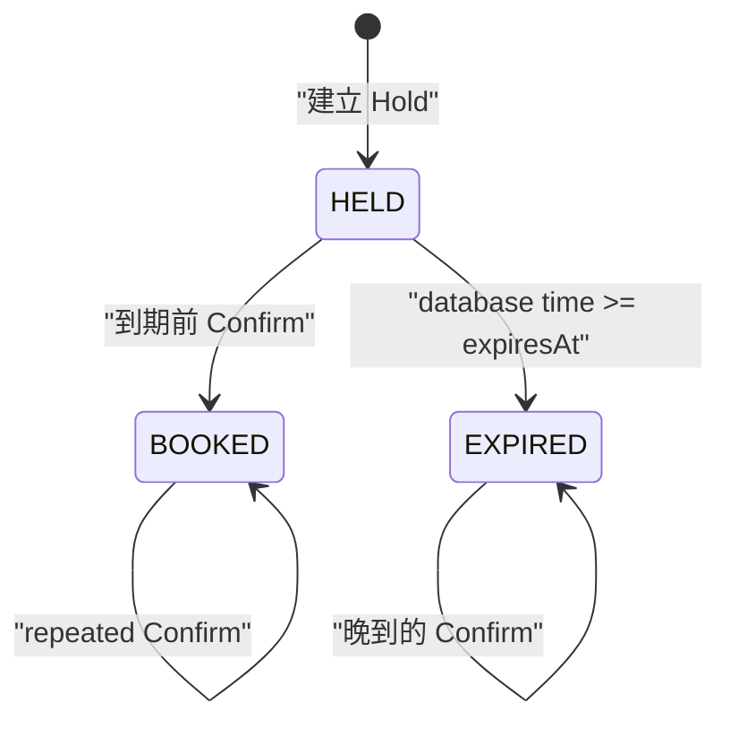
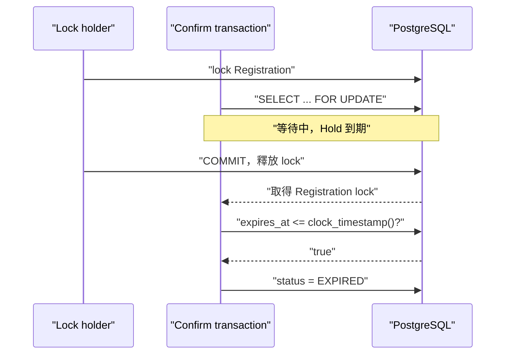
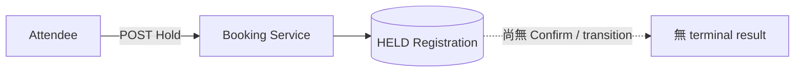
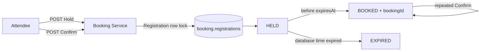

# Lesson 04 — 完成 Registration lifecycle

## 目標

完成這一課後，你可以：

- 將 Held Registration 安全地 transition 成 Booked；
- 讓 repeated Confirm 回傳同一個 `bookingId`；
- 使用 PostgreSQL time lazy evaluation 過期的 Hold；
- 解釋為什麼時間判斷必須在取得 row lock 之後；
- 讓 duplicate concurrent Hold requests 回傳同一 Registration；
- 讓 Attendee 在先前 Hold 過期後重新競爭 Spot。

## Lifecycle

RushBook 不把 Hold、Booking、Expired attempt 分散到三張 tables。它們是同一筆
Registration 在不同時間的狀態：



`BOOKED` 與 `EXPIRED` 都是 terminal states。Attendee 重新競爭時會建立新的
Registration，而不是把舊的 EXPIRED row 改回 HELD。

## 核心觀念

### Confirm 是 conditional state transition

Confirm transaction 依序：

1. `SELECT ... FOR UPDATE` 鎖 Registration row；
2. 若已是 `BOOKED`，回傳既有 Booking；
3. 若已是 `EXPIRED`，回傳 `HOLD_EXPIRED`；
4. 若是 `HELD`，在取得 lock 後詢問 PostgreSQL time；
5. 單一 conditional `UPDATE` 只有在該 database time 尚未到期時，才設定
   `BOOKED`、新 `booking_id` 與相同的 `confirmed_at`。

這些步驟必須在同一 transaction，否則兩個 Confirms 可能同時看見 HELD，
各自產生不同 Booking。

### 為什麼時間判斷要放在 lock 之後？

假設 Confirm request 在 `expiresAt` 前到達，但 Registration row 正被另一個
transaction 鎖住。它等到取得 lock 時可能已經過期。



若 application 在等待前就記住「尚未過期」，醒來後仍 Confirm，就會讓已釋放的
Spot 被重新占用。

### Lazy expiration 不需要 sweeper 才正確

RushBook 在會影響 correctness 的 writes 進行 lazy evaluation：

- Confirm 時檢查該 Registration；
- 新 Hold 在 Event lock 內先 transition 該 Event 已過期的 Holds。

capacity query 本身也只計算 `expires_at > clock_timestamp()` 的 HELD rows。
未來可以加 sweeper 清理或提供更即時的畫面，但 sweeper failure 不會造成超賣。

### Idempotency 是回傳既有成功結果

Repeated Confirm 不回錯誤，也不產生第二個 Booking，而是回傳第一次成功留下的
`bookingId` 與 `confirmedAt`。

Duplicate Hold 也相同：

- 第一個 request 建立 Registration，回 `201`；
- 後續相同 Attendee/Event requests 回 `200`；
- response body 指向完全相同的 Registration。

HTTP status 說明這次是否建立 resource；domain result 則保持一致。

### Database constraints 保護 lifecycle shape

Flyway V3 增加 `booking_id`、`confirmed_at` 與 constraints：

- HELD：Booking fields 皆為 `NULL`；
- BOOKED：Booking fields 皆非 `NULL`，而且 `confirmed_at < expires_at`；
- EXPIRED：Booking fields 皆為 `NULL`；
- 非空 `booking_id` 必須 unique。

即使 future code 寫錯，也不能留下「BOOKED 但沒有 bookingId」的半套狀態。
Conditional update 也重用同一個 database timestamp 作 expiration comparison 與
`confirmed_at`，不留下 check/use 之間的 boundary gap。

## 架構變化

### 改動前



### 改動後



## API contracts

### Confirm

```http
POST /api/registrations/{registrationId}/confirm
```

成功與 repeated Confirm 都回 `200 OK`：

```json
{
  "outcome": "BOOKED",
  "booking": {
    "registrationId": "<uuid>",
    "eventId": "<uuid>",
    "attendeeId": "attendee-001",
    "status": "BOOKED",
    "bookingId": "<uuid>",
    "confirmedAt": "<database timestamp>"
  }
}
```

過期時回 `409 Conflict`：

```json
{
  "outcome": "REJECTED",
  "reason": "HOLD_EXPIRED",
  "registrationId": "<uuid>"
}
```

不存在的 Registration 回 `404 REGISTRATION_NOT_FOUND`。

### Idempotent Hold

Request contract 不變：

```http
POST /api/events/{eventId}/holds
Content-Type: application/json

{"attendeeId":"attendee-001"}
```

第一次回 `201`；active duplicate 回 `200`。兩者的 body 相同。若舊 Hold 已過期，
write path 先將它 transition 成 EXPIRED，再建立新的 Registration 並回 `201`。

## 先自己試試看

在閱讀 code 前回答：

1. 兩個 concurrent Confirms 都在到期前開始，為什麼仍需要 row lock？
2. request 到達時間與取得 lock 時間，哪一個應決定 expiration？
3. 為什麼 repeated Confirm 應回既有 Booking，而不是 `409`？

## 實作導覽

- [V3 migration](../../booking-service/src/main/resources/db/migration/V3__add_booking_lifecycle.sql)
  加入 Booking columns、lifecycle check constraint 與 unique booking index。
- [ConfirmService.java](../../booking-service/src/main/java/dev/rushbook/booking/registration/ConfirmService.java)
  在 transaction 中處理 row lock、terminal-state idempotency、database-time
  expiration 與 Confirm。
- [RegistrationRepository.java](../../booking-service/src/main/java/dev/rushbook/booking/registration/RegistrationRepository.java)
  包含 Registration lock、lazy expiration、Confirm update 與既有 active
  Registration lookup SQL。
- [HoldService.java](../../booking-service/src/main/java/dev/rushbook/booking/registration/HoldService.java)
  在 Event lock 內先 expire，再回傳既有 active Registration 或建立新 Hold。
- [RegistrationLifecycleApiIntegrationTest.java](../../booking-service/src/test/java/dev/rushbook/booking/registration/RegistrationLifecycleApiIntegrationTest.java)
  以公開 APIs 驗證 Confirm、idempotency、expiration、lock wait 與 duplicate
  concurrency。

## 如何測試

確認 Docker engine：

```bash
docker info
```

只執行 lifecycle tests：

```bash
./gradlew --no-daemon :booking-service:test \
  --tests \
  dev.rushbook.booking.registration.RegistrationLifecycleApiIntegrationTest \
  --rerun-tasks
```

一起執行 Hold 與 lifecycle tests：

```bash
./gradlew --no-daemon :booking-service:test \
  --tests 'dev.rushbook.booking.registration.*' \
  --rerun-tasks
```

執行完整 project：

```bash
./gradlew --no-daemon clean build
```

## Row-lock expiration experiment

`confirmThatExpiresWhileWaitingForRowLockIsRejected` test：

1. 建立 5 秒 Hold；
2. 由另一條 PostgreSQL connection `FOR UPDATE` 鎖住 Registration；
3. 從公開 HTTP API 發出 Confirm，讓它等待；
4. 超過 `expiresAt` 才釋放 lock；
5. 驗證 response 是 `409 HOLD_EXPIRED`。

Database connection 只用來注入 contention；最終行為仍由公開 Confirm API
觀察，不直接 query internal state 當 assertion。

## Live API experiment

啟動 local-only PostgreSQL：

```bash
docker run --rm --detach \
  --name rushbook-lesson-04-postgres \
  --publish 5432:5432 \
  --env POSTGRES_DB=rushbook \
  --env POSTGRES_USER=booking_app \
  --env POSTGRES_PASSWORD=replace-me-for-local-only \
  postgres:18.3-alpine
```

等待 ready 並啟動 Booking Service：

```bash
docker exec rushbook-lesson-04-postgres \
  pg_isready --username booking_app --dbname rushbook

./gradlew :booking-service:bootRun
```

另一個 terminal 建立 Event、再建立 Hold：

```bash
curl --silent --include \
  --request POST http://localhost:8080/api/events \
  --header 'Content-Type: application/json' \
  --data '{"name":"Confirm Lab","capacity":1,"holdPeriodSeconds":30}'

curl --silent --include \
  --request POST http://localhost:8080/api/events/<event-id>/holds \
  --header 'Content-Type: application/json' \
  --data '{"attendeeId":"attendee-live"}'
```

對 response 的 `<registration-id>` Confirm 兩次：

```bash
curl --silent --include --request POST \
  http://localhost:8080/api/registrations/<registration-id>/confirm

curl --silent --include --request POST \
  http://localhost:8080/api/registrations/<registration-id>/confirm
```

兩次 body 的 `bookingId` 與 `confirmedAt` 必須相同。

觀察 lifecycle rows：

```bash
docker exec rushbook-lesson-04-postgres \
  psql --username booking_app --dbname rushbook \
  --command "SELECT registration_id,
                    attendee_id,
                    status,
                    booking_id,
                    expires_at,
                    confirmed_at
             FROM booking.registrations
             ORDER BY created_at;"
```

結束後在 Booking terminal 按 `Ctrl-C`，再移除 database：

```bash
docker stop rushbook-lesson-04-postgres
```

## 實際證據

TDD 過程曾捕捉到：

```text
Confirm endpoint 尚未存在：expected 200 but was 404
Repeated Confirm 產生不同 response body
Expired Confirm 被錯誤地回 200
Expired Hold retry 被錯誤地回 409
Duplicate concurrent Holds 沒有回相同 Registration
```

完成後：

```text
Registration suites: 14 test executions
failures: 0
errors: 0
```

Live database 最後同時存在合法的：

- BOOKED row：具有固定 `booking_id` 與 `confirmed_at`；
- EXPIRED row：沒有 Booking columns；
- 新 HELD row：同 Attendee 在舊 Hold 過期後重新取得。

## 本課刻意還沒做什麼

本課只證明 correctness，尚未量測熱門 Event row lock 的 latency distribution。
Lesson 05 會把 stress scenario 與 k6 evidence 變成可重複的效能實驗。

## 理解題

1. 為什麼 Registration 使用 lifecycle row，而不是把 Hold 移到 Booking table？
2. 為什麼 Confirm 必須先鎖 Registration row？
3. 為什麼 expiration check 必須發生在取得 lock 之後？
4. Lazy expiration 如何在沒有 sweeper 時仍維持 correctness？
5. Repeated Confirm 為什麼不能產生新的 `bookingId`？
6. Duplicate Hold 的 `201` 與 `200` 為什麼可以有相同 body？
7. 為什麼 EXPIRED Registration 不改回 HELD？
8. Lifecycle check constraint 防止哪些非法資料？
9. Row-lock race test 為什麼仍算公開 API test？
10. PostgreSQL time 比 application time 多解決了什麼問題？

<details>
<summary>答案與預期推理</summary>

### 1

單一 Registration row 保存完整歷史與 identity，state transition 可以用 row lock
與 conditional update 保護。搬移到另一張 table 會增加 delete/insert 的 atomicity
與 identity 問題，也更難處理 repeated Confirm。

### 2

沒有 lock 時，兩個 transactions 都可能讀到 HELD，各自產生 bookingId。鎖住
Registration 後，第二個 transaction 只能在第一個 commit 後讀到 BOOKED，因而
回傳既有結果。

### 3

request 可能在等待 lock 時跨過 `expiresAt`。取得 lock 前的時間判斷已經過時；
transaction 必須依真正能執行 transition 的時點重新詢問 database time。

### 4

Confirm 與新 Hold 都會 transition 相關的 expired rows，capacity query 也直接
排除 database-time 已過期的 HELD。Sweeper 只影響資料何時整理，不影響名額是否
可重新使用。

### 5

Booking 是 Confirm 的 terminal business effect。每次 retry 都換 bookingId，
會把網路重送變成多個不同 Bookings，也讓 downstream outbox 無法安全
idempotent。

### 6

body 表示同一個 domain result；status 則表示本次 HTTP request 是否建立新
resource。Retry 讀回既有 Registration，所以回 200，但不能改變 Registration
identity。

### 7

EXPIRED 是已結束的嘗試，保留它才能追蹤歷史。重新競爭會建立新的 Registration，
因此新的 `expiresAt`、identity 與結果不會覆蓋舊紀錄。

### 8

它禁止 HELD／EXPIRED 帶有 Booking fields，也禁止 BOOKED 缺少 `booking_id`
或 `confirmed_at`。Unique index 另外禁止兩筆 Bookings 共用同一 bookingId。

### 9

另一條 database connection 只負責製造真實 lock wait，就像 production 中的
concurrent transaction。測試沒有從 table 讀取結果來宣稱成功；它仍透過 HTTP
status 與 response contract 驗證可觀察行為。

### 10

多 replicas 的 host clocks 可能不同。PostgreSQL 同時擁有 lifecycle state、
row locks 與「現在」，因此所有 transactions 對 expiration boundary 使用同一
source of truth。

</details>
