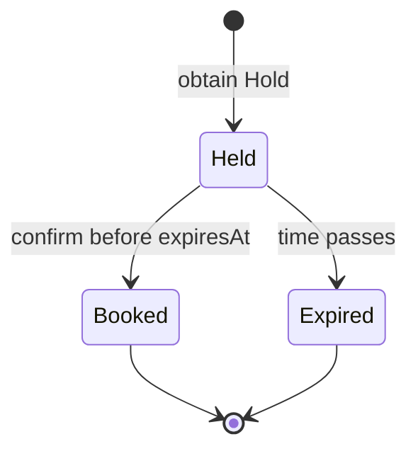

# 產品範圍

RushBook 讓 Organizer 建立限量名額的 Event，並讓許多 Attendee 在不超賣的
前提下競爭彼此等價的 Spot。產品刻意維持小規模，才能深入處理 correctness、
messaging 與 operations。

Canonical terms 定義在 [CONTEXT.md](../CONTEXT.md)。

## MVP 流程

### 建立 Event

Organizer 提供：

- 名稱；
- 大於零的 capacity；
- 5 到 900 秒之間的 Hold Period，預設為 120 秒。

Event 建立後立即接受 Hold request。Registration Window、指定座位、價格與
capacity 修改都不在 MVP 範圍內。

### 取得 Hold

由可信任 opaque `attendeeId` 識別的 Attendee 要求一個 Spot。若仍有容量，
RushBook 就建立 Held 狀態的 Registration。

- 發生競爭時，由先成功 commit 的 request 取得 Spot。
- 不保證 strict FIFO。
- 同一位 Attendee 在同一場 Event 最多只能有一個 active Registration。
- 重複 request 回傳既有的 active result。
- 已到期的嘗試不會阻止 Attendee 再次嘗試。

### 確認 Booking

Attendee 必須在 `expiresAt` 前確認 Held Registration。確認會把 Registration
改為 Booked，並配置一個 `bookingId`。

- 到期後 Confirm 會失敗。
- 重複確認成功的 Registration 會回傳同一個 Booking。
- Booking 在 MVP 中是 terminal state。
- Cancellation 是 stretch feature。

### 執行 Simulation

Simulation Dashboard 產生 synthetic Attendees，並讓它們使用與一般client相同
的公開 Hold 與 Confirm APIs。Simulation 絕不直接向 Kafka 發送
`BookingConfirmed`。

Dashboard 顯示：

- Hold、Booking 與 capacity exhausted 數量；
- outbox pending 與 published 數量；
- Kafka consumer lag、retry 與 DLQ 數量；
- 最近的 Notification feed；
- 由真實系統狀態驅動的簡化 live pipeline。

UI 可以注入 application-level Notification failure。Kubernetes 與 Kafka
infrastructure failures 必須透過文件化的 CLI scripts 執行，不能為了操作
cluster 而把 cluster-admin credentials 交給 application。

## Domain invariants

1. Booked Registrations 加上尚未到期的 Held Registrations，絕不能超過 Event
   capacity。
2. 同一位 Attendee 在同一場 Event 最多只能有一個 Held 或 Booked
   Registration。
3. 只有尚未到期的 Held Registration 可以變成 Booked。
4. Booking confirmation 與對應的 outbox record 必須 atomic commit。
5. Kafka `messageId` 即使被 redeliver，也最多只能產生一次 Notification
   business effect。

## Registration lifecycle

Expiration correctness 採用 lazy evaluation：transaction 以 database time
比較 `expiresAt`。Sweeper 可以為了 housekeeping 把舊資料標成 Expired，但
capacity 與 confirmation correctness 絕不能依賴 sweeper 準時執行。

## Identity 與 trust boundary

Authentication 不在 MVP 範圍內。API 接受可信任的 opaque `attendeeId`，讓測試
可以在不加入 OAuth 或 session management 的前提下模擬許多 Attendees。這個
boundary 適合本機學習系統，不適合直接暴露在 production internet。

## 不在 MVP 範圍內

- authentication 與 authorization；
- payment、price、refund 與 Booking cancellation；
- assigned seating 與 seat map；
- Registration Window 與 virtual waiting room；
- strict request arrival ordering；
- Redis、distributed lock 與 cache；
- Event 建立後修改 capacity；
- production-grade PostgreSQL 或 Kafka disaster recovery；
- managed-cloud deployment 與 Terraform。

## Acceptance scenarios

- 一百位 Attendees 競爭十個 Spots；最後恰好十筆 Booking confirmed，且任何
  時刻都不超賣。
- 同一位 Attendee 同時送出重複 Hold requests；最後只有一個 active
  Registration，而且兩次呼叫取得相同結果。
- Confirm 等待 lock，真正執行時已超過 `expiresAt`；Confirm 必須失敗。
- Confirm 時 Kafka 無法使用；Booking 仍成功，Kafka 恢復後由 outbox 發布。
- Notification 已 commit database work，但在 commit Kafka offset 前 crash；
  redelivery 不會產生重複 Notification。
- Poison message retry 三次後進入 DLQ。
- Notification Service scale 到零；Booking 繼續運作、consumer lag 上升，
  restore 後 lag 逐步清空。
